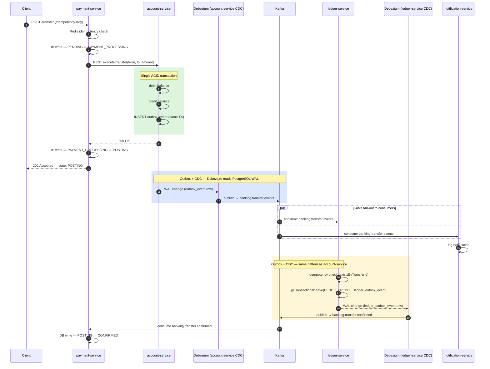
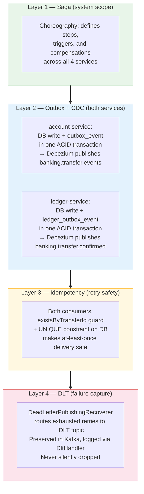

Distributed transactions are one of those problems where the naive solution is obvious and wrong, the correct solution is non-obvious, and the real difficulty is understanding which correct solution applies to which layer of your system.

When I built BankForge — a core banking platform with four microservices, Kafka event streaming, and a Debezium CDC pipeline — I ended up using three different patterns to solve what initially looked like the same problem: *how do you guarantee consistency when a single business operation spans multiple services and databases?*

The three patterns are the **Saga**, the **Transactional Outbox with CDC**, and **Kafka EOS with DB transactions**. I originally used all three. By the end of the build I had dropped Kafka EOS entirely and extended the Outbox + CDC pattern to cover what EOS was supposed to handle. This post explains why — and what the decision reveals about when each pattern actually applies.

---

## The Problem They All Address

In a monolith, a database transaction gives you atomicity for free. One `BEGIN ... COMMIT` and either everything happens or nothing does.

In a microservices system, you have no such luxury. A single business operation — a bank transfer — might touch:

- `payment-service`: record the transfer intent and state
- `account-service`: debit and credit account balances
- `ledger-service`: write the double-entry bookkeeping records
- Kafka topics: propagate events between services

None of these share a transaction boundary. And there is no distributed 2PC that works reliably at scale.

So how do you get consistency without 2PC? You use a combination of patterns — each one operating at a different layer.

---

## Pattern 1: The Saga

### What it is

A Saga replaces a single distributed transaction with a sequence of local transactions, each committed independently, with compensating transactions that undo prior steps if a later step fails.

There are two styles:
- **Choreography**: each service reacts to events and publishes new events. No central coordinator.
- **Orchestration**: a central service explicitly directs each step and handles failures.

BankForge uses choreography. The transfer flow looks like this:



Each service does its local work and emits an event. The next service reacts. If `account-service` fails (e.g. insufficient funds), `payment-service` catches the error synchronously and fires a compensating transaction (reversal). If `ledger-service` fails after account balances have already moved, the saga has a compensation path for that too.

### What it solves

The Saga answers the question: *how do I coordinate a multi-step business operation across multiple services?* It defines the sequence of steps, what triggers each step, and what rolls back if a step fails.

### What it does NOT solve

The Saga pattern says nothing about *how reliably* each event is delivered or *how safely* each step executes internally. A saga step can still fail in ways that leave the system inconsistent — if the service crashes between doing its local DB work and publishing the event that triggers the next step.

That gap is what the next two patterns address.

---

## Pattern 2: Transactional Outbox with CDC

### The problem it solves

Consider `account-service`. After it debits and credits account balances, it needs to publish a Kafka event to trigger `ledger-service`. The naive approach:

```java
accountRepository.save(debit);   // DB write
accountRepository.save(credit);  // DB write
kafkaTemplate.send("banking.transfer.events", event);  // Kafka publish
```

This has a **dual-write problem**. The DB commit and the Kafka publish are two separate operations. If the JVM crashes between them, the money has moved but no event was published. The saga is stuck. The ledger never gets updated.

The Transactional Outbox pattern eliminates this gap. Instead of publishing directly to Kafka, the service writes the event to an `outbox_event` table *in the same database transaction* as the business data change:

```java
@Transactional
public TransferResponse executeTransfer(TransferRequest request) {
    // Business data change
    debit.setBalance(debit.getBalance().subtract(amount));
    credit.setBalance(credit.getBalance().add(amount));

    // Outbox write — same transaction
    outboxEventRepository.save(OutboxEvent.builder()
        .aggregatetype("transfer")
        .type("TransferInitiated")
        .payload(serialize(event))
        .build());

    // No Kafka call here — the outbox row IS the event
}
```

Either both the balance changes and the outbox row commit, or neither does. The dual-write gap is closed.

### How CDC fits in

A separate process — Debezium — continuously reads the PostgreSQL Write-Ahead Log (WAL) and publishes new rows in the `outbox_event` table to Kafka. Debezium's `EventRouter` SMT routes rows to the correct topic based on the `aggregatetype` column.

```
PostgreSQL WAL
     │
     ▼
Debezium (reads WAL continuously)
     │
     ▼
banking.transfer.events  ──▶  ledger-service
                          ──▶  notification-service
```

The Kafka publish is no longer the application's responsibility. Debezium guarantees at-least-once delivery from the WAL to Kafka, with checkpointing so it recovers correctly after a restart.

---

## Pattern 3: Why We Started with Kafka EOS and Dropped It

### The original problem

Consider `ledger-service`. Its job is to consume an event from Kafka, process it (write ledger entries), and produce a downstream event (`banking.transfer.confirmed`).

The original implementation had this gap:

```java
@Transactional
public void onTransferEvent(String payload) {
    ledgerEntryRepository.save(debit);
    ledgerEntryRepository.save(credit);
    // ↑ @Transactional commits here

    kafkaTemplate.send("banking.transfer.confirmed", ...);
    // ↑ outside the transaction — crash here = stuck saga
}
```

If the JVM crashes after the DB commit but before `kafkaTemplate.send()`, the ledger entries exist but `banking.transfer.confirmed` is never published. `payment-service` is stuck in `POSTING` state forever.

### Why we chose Kafka EOS initially

Kafka EOS (Exactly-Once Semantics) seemed like the right shape for this problem. With a `KafkaTransactionManager` wired to the listener container, the consumer offset advance and the producer send become a single atomic Kafka transaction:

```
Container begins Kafka TX
  → calls onTransferEvent(...)
    → DB TX begins (@Transactional)
      → save(debit)
      → save(credit)
    → DB TX commits
    → kafkaTemplate.send() — buffered in Kafka TX, not sent yet
  → Kafka TX commits atomically:
      consumer offset advanced
      produced message visible to readers
```

If the JVM crashes before the Kafka TX commits, the offset is not advanced. The message is redelivered. On retry, the DB saves are re-attempted — which is why idempotency is also required.

This is genuinely the right mental model for the consume → process → produce shape. The conceptual fit is clean.

### Why we dropped it

Two problems emerged in practice.

**Problem 1: EOS conflicts with Dead Letter Topics.**

A Dead Letter Topic (DLT) is essential for any financial event consumer. When a message exhausts its retries — invalid payload, unresolvable error — it must not be silently dropped. Spring Kafka's `DeadLetterPublishingRecoverer` routes exhausted messages to a `.DLT` topic. But it requires a **non-transactional** `KafkaTemplate` to do so.

`KafkaTransactionManager` (the EOS dependency) makes the application's `KafkaTemplate` transactional. You cannot have both. Either you give up EOS or you give up the DLT. For a banking system, giving up the DLT is not an option — silent event loss is worse than duplicate processing.

**Problem 2: Operational complexity for a problem already solved.**

EOS requires: `KafkaTransactionManager`, `EOSMode.V2`, a transactional producer factory, and careful coordination between the Kafka TX and the JPA TX. It also constrains the consumer container configuration in ways that interact badly with retry backoff settings.

Meanwhile, the codebase already had a proven solution for the produce-reliably problem: the Outbox + CDC pattern used in `account-service`. The question became: why not use the same pattern in `ledger-service` instead?

### What we did instead

`ledger-service` was refactored to use the same Outbox + CDC pattern as `account-service`:

```java
@Transactional
@KafkaListener(topics = "banking.transfer.events")
public void onTransferEvent(String payload) {
    // Idempotency guard — safe at-least-once redelivery
    if (ledgerEntryRepository.existsByTransferId(transferId)) {
        return;  // already processed — outbox row already written, Debezium already published
    }

    ledgerEntryRepository.save(debit);
    ledgerEntryRepository.save(credit);

    // Write outbox row in the same JPA transaction — no direct Kafka call
    ledgerOutboxEventRepository.save(LedgerOutboxEvent.builder()
        .aggregateid(transferId.toString())
        .aggregatetype("transfer-confirmation")
        .type("TransferConfirmed")
        .payload(serialize(confirmation))
        .build());

    // Debezium reads the outbox row from the WAL and publishes banking.transfer.confirmed
}
```

A second Debezium connector was added pointing at `ledger-db`, watching the `ledger_outbox_event` table, publishing to `banking.transfer.confirmed`.

The failure matrix with this approach:

| Crash point | DB state | Outbox state | Recovery |
|---|---|---|---|
| During saves | rolled back | rolled back | Offset not advanced → clean retry |
| After DB+outbox commit | committed | committed | Debezium publishes confirmation — done |
| Debezium lag | committed | committed | Debezium recovers from WAL — publishes eventually |

The idempotency guard handles the retry window: if the message is redelivered after the DB commit but before the consumer offset advances, `existsByTransferId` returns true and the handler exits without duplicate writes.

### What this reveals about the CDC vs EOS distinction

The standard framing is: CDC is for **event origins**, EOS is for **pipeline processors**. That framing is not wrong exactly — but it is incomplete.

The real question is: *what is the atomicity unit you need?*

For `account-service` (event origin): you need the DB write and the event entering Kafka to be atomic. CDC provides exactly that.

For `ledger-service` (pipeline processor): you also need the DB write and the event entering Kafka to be atomic. CDC provides exactly that too — with an outbox row standing in for the direct Kafka publish.

The distinction between "origin" and "processor" matters for understanding the shape of the problem. But it does not change which tool solves it. Both shapes reduce to the same atomicity requirement: *write to DB and write the outbox row in one transaction; let the reliable relay (Debezium) handle the rest.*

EOS solves a *different* atomicity unit: offset advance + Kafka produce. That unit is useful — but it requires giving up DLT compatibility, and it does not eliminate the need for idempotency anyway. Outbox + CDC + idempotency solves the same failure modes with fewer constraints.

---

## The Difference in One Sentence Each

**Saga:** Coordinates a multi-step business operation across services — defines the steps, triggers, and compensations.

**Outbox + CDC:** Guarantees an event reliably enters a message broker — eliminates the dual-write gap between a DB commit and a Kafka publish. Applies at both event origins and intermediate pipeline steps.

**Kafka EOS:** Guarantees consume → produce is atomic from Kafka's perspective. Conceptually clean, but conflicts with Dead Letter Topics and does not eliminate the need for idempotency. We dropped it in favour of Outbox + CDC + idempotency.

---

## How They Layer Together



Remove the Saga and you have no coordination — services do isolated work with no defined flow. Remove the Outbox and a service can crash between its DB commit and the event entering Kafka, leaving the saga stuck. Remove idempotency and at-least-once redelivery produces duplicate ledger entries. Remove the DLT and poison pill messages are silently dropped, leaving the transfer state unknown.

Each layer is necessary. EOS was a candidate for one layer that turned out to create more problems than it solved — specifically because it is incompatible with the DLT layer that sits below it.

---

*BankForge is an open-source Australian core banking platform built as a learning sandbox for enterprise microservices patterns. The source is on GitHub.*
