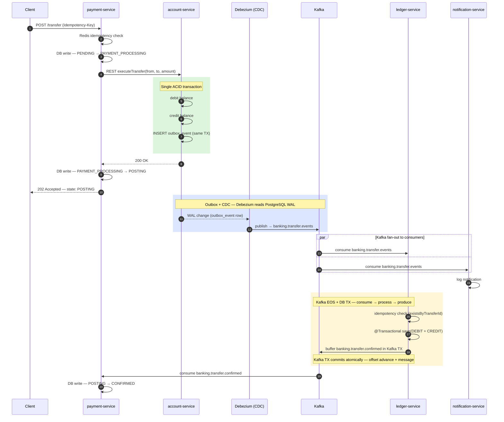
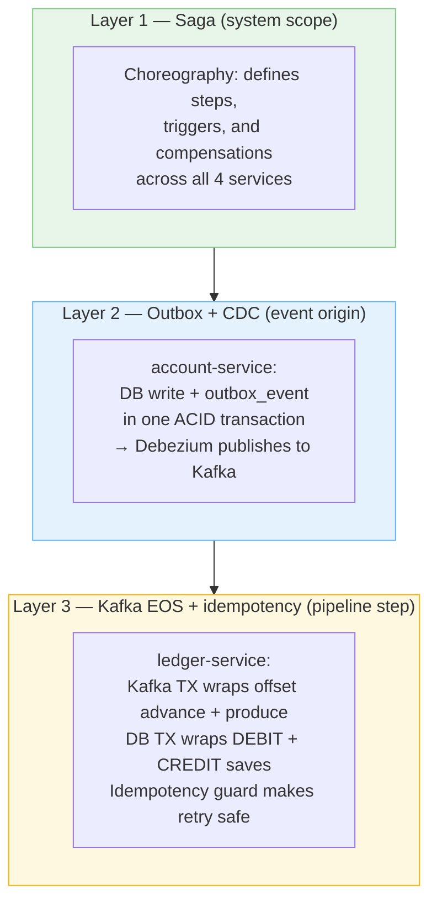

Distributed transactions are one of those problems where the naive solution is obvious and wrong, the correct solution is non-obvious, and the real difficulty is understanding which correct solution applies to which layer of your system.

When I built BankForge — a core banking platform with four microservices, Kafka event streaming, and a Debezium CDC pipeline — I ended up using three different patterns to solve what initially looked like the same problem: *how do you guarantee consistency when a single business operation spans multiple services and databases?*

The three patterns are the **Saga**, the **Transactional Outbox with CDC**, and **Kafka EOS with DB transactions**. They are not alternatives. They solve different layers of the same problem. Using the wrong one for the wrong layer is a common mistake.

Here is how they differ, where each one applies, and how they fit together in a real system.

---

## The Problem They All Address

In a monolith, a database transaction gives you atomicity for free. One `BEGIN ... COMMIT` and either everything happens or nothing does.

In a microservices system, you have no such luxury. A single business operation — a bank transfer — might touch:

- `payment-service`: record the transfer intent and state
- `account-service`: debit and credit account balances
- `ledger-service`: write the double-entry bookkeeping records
- Kafka topics: propagate events between services

None of these share a transaction boundary. And there is no distributed 2PC that works reliably at scale.

So how do you get consistency without 2PC? You use a combination of the three patterns described below — each one operating at a different layer.

---

## Pattern 1: The Saga

### What it is

A Saga replaces a single distributed transaction with a sequence of local transactions, each committed independently, with compensating transactions that undo prior steps if a later step fails.

There are two styles:
- **Choreography**: each service reacts to events and publishes new events. No central coordinator.
- **Orchestration**: a central service explicitly directs each step and handles failures.

BankForge uses choreography. The transfer flow looks like this:



Each service does its local work and emits an event. The next service reacts. If `account-service` fails (e.g. insufficient funds), `payment-service` catches the error synchronously and fires a compensating transaction (reversal). If `ledger-service` fails after account balances have already moved, the saga has a compensation path for that too.

### What it solves

The Saga answers the question: *how do I coordinate a multi-step business operation across multiple services?* It defines the sequence of steps, what triggers each step, and what rolls back if a step fails.

### What it does NOT solve

The Saga pattern says nothing about *how reliably* each event is delivered or *how safely* each step executes internally. A saga step can still fail in ways that leave the system inconsistent — if the service crashes between doing its local DB work and publishing the event that triggers the next step.

That gap is what the next two patterns address.

---

## Pattern 2: Transactional Outbox with CDC

### The problem it solves

Consider `account-service`. After it debits and credits account balances, it needs to publish a Kafka event to trigger `ledger-service`. The naive approach:

```java
accountRepository.save(debit);   // DB write
accountRepository.save(credit);  // DB write
kafkaTemplate.send("banking.transfer.events", event);  // Kafka publish
```

This has a **dual-write problem**. The DB commit and the Kafka publish are two separate operations. If the JVM crashes between them, the money has moved but no event was published. The saga is stuck. The ledger never gets updated.

The Transactional Outbox pattern eliminates this gap. Instead of publishing directly to Kafka, the service writes the event to an `outbox_event` table *in the same database transaction* as the business data change:

```java
@Transactional
public TransferResponse executeTransfer(TransferRequest request) {
    // Business data change
    debit.setBalance(debit.getBalance().subtract(amount));
    credit.setBalance(credit.getBalance().add(amount));

    // Outbox write — same transaction
    outboxEventRepository.save(OutboxEvent.builder()
        .aggregatetype("transfer")
        .type("TransferInitiated")
        .payload(serialize(event))
        .build());

    // No Kafka call here — the outbox row IS the event
}
```

Either both the balance changes and the outbox row commit, or neither does. The dual-write gap is closed.

### How CDC fits in

A separate process — Debezium — continuously reads the PostgreSQL Write-Ahead Log (WAL) and publishes new rows in the `outbox_event` table to Kafka. Debezium's `EventRouter` SMT routes rows to the correct topic based on the `aggregatetype` column.

```
PostgreSQL WAL
     │
     ▼
Debezium (reads WAL continuously)
     │
     ▼
banking.transfer.events  ──▶  ledger-service
                          ──▶  notification-service
```

The Kafka publish is no longer the application's responsibility. Debezium guarantees at-least-once delivery from the WAL to Kafka, with checkpointing so it recovers correctly after a restart.

### When to use it

Use the Outbox + CDC pattern at the **origin of an event** — where a service is the authoritative source of truth for a domain event and must guarantee that event enters the pipeline.

In BankForge, `account-service` is the right place. It owns account balances. The transfer event is a fact that must not be lost. CDC is the bridge that reliably carries it to Kafka without requiring the application to manage that bridge itself.

The setup cost is real: you need a Debezium connector, a `wal_level=logical` PostgreSQL config, and an outbox table. For a service that is not the origin of critical events, the cost may not be justified.

---

## Pattern 3: Kafka EOS with DB Transaction

### The problem it solves

Now consider `ledger-service`. Its job is different: it *consumes* an event from Kafka, *processes* it (writes ledger entries), and *produces* a downstream event (`banking.transfer.confirmed`).

The original implementation had this gap:

```java
@Transactional
public void onTransferEvent(String payload) {
    ledgerEntryRepository.save(debit);
    ledgerEntryRepository.save(credit);
    // ↑ @Transactional commits here

    kafkaTemplate.send("banking.transfer.confirmed", ...);
    // ↑ outside the transaction — crash here = stuck saga
}
```

If the JVM crashes after the DB commit but before `kafkaTemplate.send()`, the ledger entries exist but `banking.transfer.confirmed` is never published. `payment-service` is stuck in `POSTING` state forever.

You might ask: why not use Outbox + CDC here too? The answer is that CDC is the **wrong shape** for this problem — and understanding why is the most important distinction in this post.

**CDC solves event origination.** It answers the question: *how does a new fact get reliably introduced into the event pipeline for the first time?* `account-service` is introducing a new fact — a transfer happened, balances moved. CDC carries that fact from the database out to Kafka. That is CDC's job.

**`ledger-service` is not introducing a fact. It is processing one.** The transfer event already exists in Kafka. `ledger-service`'s job is to consume it, do local work, and emit a downstream signal. The fact was originated upstream. `ledger-service` is a pipeline processor, not an event origin.

This distinction matters because the atomicity unit you need is completely different:

| Role | Atomicity unit needed | Pattern |
|---|---|---|
| Event origin (account-service) | DB write + event enters Kafka | Outbox + CDC |
| Pipeline processor (ledger-service) | Consumer offset advance + downstream event | Kafka EOS |

CDC has no concept of a **consumer offset**. It reads the WAL and publishes to Kafka — it knows nothing about whether a downstream consumer has processed a message or where it is in the topic. It cannot help you answer: *"I consumed this message — how do I guarantee my downstream publish is atomic with acknowledging that consumption?"*

Kafka EOS was designed for exactly that question. The atomicity unit it provides — offset advance and produced message commit together or not at all — maps directly to the consume→process→produce shape that `ledger-service` has. That is not a coincidence. That is precisely the problem Kafka EOS exists to solve.

Adding Outbox + CDC to `ledger-service` would mean: a second Debezium connector, a second outbox table, a second WAL reader — all to solve a problem that is not CDC's problem to solve. You would be using the wrong tool and paying the wrong cost.

### How Kafka EOS works

With a `KafkaTransactionManager` wired to the listener container, the consumer offset advance and the producer send become a single atomic Kafka transaction:

```
Container begins Kafka TX
  → calls onTransferEvent(...)
    → DB TX begins (@Transactional)
      → save(debit)
      → save(credit)
    → DB TX commits
    → kafkaTemplate.send() — buffered in Kafka TX, not sent yet
  → Kafka TX commits atomically:
      consumer offset advanced
      produced message visible to readers
```

If the JVM crashes before the Kafka TX commits, the offset is not advanced. The message is redelivered. On retry, the DB saves are re-attempted.

### The missing piece: idempotency

Kafka EOS alone is not enough. On retry, the DB saves run again. Without a uniqueness constraint, you get duplicate ledger entries.

The fix is two parts:

1. A database constraint: `UNIQUE (transfer_id, entry_type)` on `ledger_entries`
2. An application-level guard that skips inserts if entries already exist, but still publishes the confirmation

```java
@Transactional
@KafkaListener(topics = "banking.transfer.events")
public void onTransferEvent(String payload) {
    // Idempotency guard — safe to retry
    if (ledgerEntryRepository.existsByTransferId(transferId)) {
        kafkaTemplate.send("banking.transfer.confirmed", ...);  // re-publish in case it was lost
        return;
    }

    ledgerEntryRepository.save(debit);
    ledgerEntryRepository.save(credit);
    kafkaTemplate.send("banking.transfer.confirmed", ...);
}
```

Now the full failure matrix is safe:

| Crash point | DB state | Kafka state | Recovery |
|---|---|---|---|
| During saves | rolled back | Kafka TX rolled back | Offset not advanced → clean retry |
| After DB commit, before Kafka TX commit | committed | Kafka TX rolled back | Offset not advanced → retry → idempotency guard → re-publishes confirmation |
| After Kafka TX commit | committed | committed | Done — exactly once |

### When to use it

Use Kafka EOS + DB transactions at **intermediate pipeline steps** — where a service consumes from Kafka, does local work, and produces back to Kafka. The goal is to make the consume → process → produce unit atomic from Kafka's perspective, combined with idempotent DB writes for the retry window.

In BankForge, `ledger-service` is the right place. It sits in the middle of the pipeline. The Outbox + CDC pattern would require a second Debezium connector and a second outbox table — more operational overhead for a problem that Kafka EOS solves directly.

---

## The Difference in One Sentence Each

**Saga:** Coordinates a multi-step business operation across services — defines the steps, triggers, and compensations.

**Outbox + CDC:** Guarantees an event reliably enters a message broker at the point of origin — eliminates the dual-write gap between a DB commit and a Kafka publish.

**Kafka EOS + DB transaction:** Guarantees a consume → process → produce pipeline step is atomic — offset advance and produced message commit together, idempotent DB writes handle the retry window.

---

## How They Layer Together

They are not alternatives. In BankForge they are three layers of the same system:



Remove the Saga and you have no coordination — services do isolated work with no defined flow. Remove the Outbox and the saga can get stuck because its triggering event was silently dropped. Remove Kafka EOS and the saga can get stuck because a downstream step crashed between its DB commit and its Kafka publish.

Each pattern operates at a different scope: the Saga at the system level, the Outbox at the event origin, Kafka EOS at the pipeline step. You need all three to build a system that is consistent under realistic failure conditions — not just when everything goes right.

---

*BankForge is an open-source Australian core banking platform built as a learning sandbox for enterprise microservices patterns. The source is on GitHub.*
