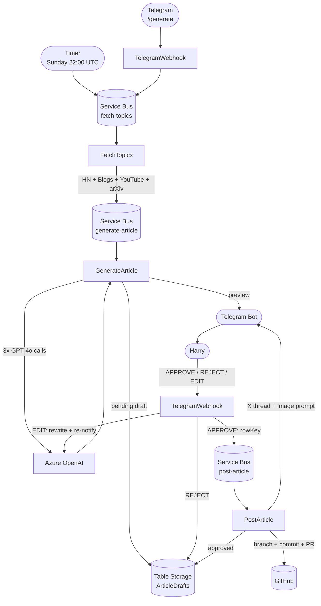
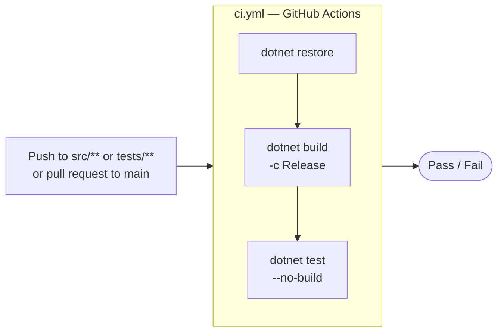

I got tired of the gap between "I should write about this" and actually writing it. So I built PulsePost — an event-driven pipeline that monitors AI trends, drafts articles in my voice, asks for my approval via Telegram, and publishes directly to this blog.

Here's how it works.

## The pipeline

Five Azure Functions wired together through Service Bus queues:



Every Sunday at 10pm UTC, a timer trigger fires and drops a message into the `fetch-topics` queue. Everything after that is reactive — no polling, no cron juggling, just messages flowing through queues.

## Topic fetching

`TopicFetchService` hits four sources in parallel:

- **Hacker News top stories** — filtered by AI keywords (`llm`, `agent`, `mcp`, `rag`, `claude`, `openai`, etc.)
- **Company RSS feeds** — OpenAI, Google DeepMind, Meta AI blogs
- **YouTube feeds** — Karpathy, Yannic Kilcher, Two Minute Papers, Lex Fridman, and others via Atom XML
- **arXiv** — latest `cs.AI` papers

All four fetches run concurrently with `Task.WhenAll`. The combined JSON goes straight into the `generate-article` queue.

## Article generation

`GenerateArticle` calls Azure OpenAI three times in sequence:

1. **Topic selection** — GPT-4o picks the single most interesting topic from the raw feed dump and returns structured JSON with title, angles, why-now context, and source links
2. **Article draft** — 800-1200 words in my voice, with code examples in C#, Python, or TypeScript depending on the topic
3. **X thread** — 6-8 tweets reformatted from the article, plus an image prompt for DALL-E

The style prompt I feed GPT-4o is blunt:

```
Harry writes in first-person, direct, opinionated tone. Technical but accessible.
He uses real-world examples, often from banking or logistics systems.
He avoids fluff — every paragraph makes a point.
Short sentences. Occasional rhetorical questions. No corporate speak.
```

The draft lands in Azure Table Storage with status `pending`, then I get a Telegram message with the topic, source links, a two-tweet preview, and the image prompt.

## The approval gate

This is the part I actually care about. I don't want to auto-publish without reading it.

The `TelegramWebhook` Azure Function receives HTTP POST from Telegram and handles three commands:

```
APPROVE       → enqueues to post-article, publishes
REJECT        → marks draft rejected, discarded
EDIT <notes>  → rewrites with feedback, sends revised preview
```

The `EDIT` flow is genuinely useful. I might reply `EDIT make it more focused on the distributed systems angle` and get a revised draft in under a minute. I can iterate as many times as I want before approving.

There's also a `/generate` command to manually kick off the pipeline at any time — useful when something breaks in the news mid-week.

Security: the webhook checks `TELEGRAM_CHAT_ID` before processing any message. Unknown senders are silently dropped.

## Publishing

Once approved, `PostArticle` calls the GitHub Contents API to create the `.md` file directly in `_posts/`, then opens a pull request. GitHub Pages builds and deploys automatically on merge.

The Telegram confirmation includes the full X thread ready to copy-paste, and the DALL-E image prompt. I still generate the cover image manually and attach it before merging — that's the one step I haven't automated yet.

## Infrastructure as Code

The entire Azure environment is provisioned with Terraform and Bicep:

- Azure Function App (Consumption plan)
- Service Bus namespace with three queues (`fetch-topics`, `generate-article`, `post-article`)
- Storage Account (Function host + Azure Table Storage for drafts)
- Application Insights for observability

Both Terraform and Bicep provision the same infrastructure — two IaC approaches side by side, useful for comparing syntax and tooling on a real project.



GitHub Actions runs a single CI workflow on every push or PR touching `src/` or `tests/`. Deploy and infrastructure provisioning are run manually.

## What I learned

**Service Bus over HTTP chaining.** I could have chained these functions with HTTP calls, but queues give me retry logic, dead-lettering, and natural backpressure for free. If the OpenAI call fails, the message stays in the queue and retries — no custom retry logic needed.

**Azure Table Storage is underrated.** For a simple draft store with a handful of columns, it's free tier, zero config, and native to the Functions ecosystem. I don't need a full database for this.

**The approval gate is the feature.** Auto-publishing without review would be fast but risky. The Telegram loop keeps me in control without adding friction — I can approve from my phone in 30 seconds.

The full source is on [GitHub](https://github.com/Harry-Zhao-AU/PulsePost).
