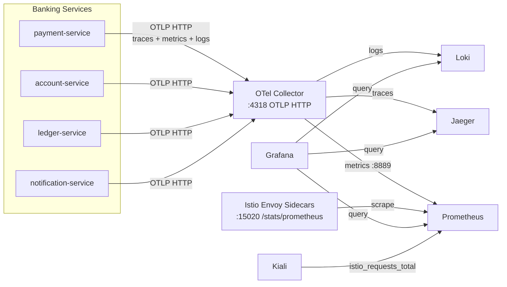
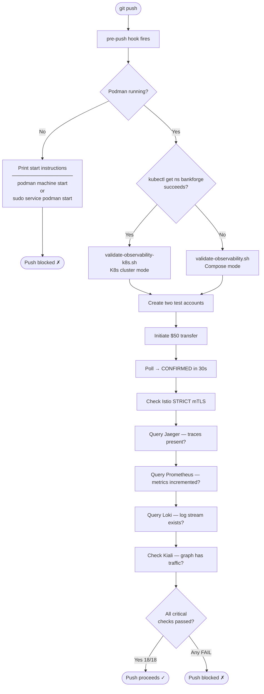

When I started BankForge, I made a decision that felt like over-engineering at the time: full production-grade observability from day one. Not "add it later when something breaks." From day one.

Six tools. All wired together. All running in the kind cluster before I wrote a single saga step.

The reason isn't what I expected it to be.

---

## The Stack

Here's how the pieces fit together:



**OpenTelemetry Collector** is the central hub. Every service sends traces, metrics, and logs to the OTel Collector via OTLP. The collector fans them out to the right backend. Services are decoupled from the backends — I can swap Jaeger for Tempo without touching application code.

**Jaeger** handles distributed tracing. When a transfer goes through the saga (payment-service → account-service → ledger-service → notification-service), Jaeger shows the full call chain as a single trace with timing on every span. When a saga gets stuck, I open Jaeger and see exactly which service stopped responding and when.

**Prometheus** handles metrics. Transfer counts, error rates, latency histograms, Istio request rates (`istio_requests_total`) — all scraped and stored as time series. Prometheus pulls from the OTel Collector's metrics endpoint *and* directly from Istio Envoy sidecars via Kubernetes pod discovery. Getting both required a `ClusterRole` and annotation-based relabeling — Istio annotates injected pods automatically at port 15020.

**Loki** handles log aggregation. Every service logs structured JSON; OTel ships those logs to Loki. Instead of `kubectl logs payment-service-xxxx`, I can query across all services simultaneously: show me every log line that mentions this transfer ID, across all four services, in time order.

**Grafana** ties Prometheus, Loki, and Jaeger together in one UI. I pre-provisioned a banking dashboard showing transfer volume, saga state distribution, and p95 latency — visible the moment the stack comes up.

**Kiali** renders the service mesh as a live graph. Kiali reads `istio_requests_total` from Prometheus and draws which services are talking to which, with error rates and latency on every edge. This is where you see that account-service has an error rate spike on calls from payment-service before you even know which endpoint is involved.

---

## Why This Particular Combination

Each tool solves a problem the others can't:

**Jaeger answers "what happened in this request."** A trace gives you causality — A called B called C, C took 800ms, that's why the saga was slow. Metrics and logs can't reconstruct this because they don't record the parent-child relationship between operations.

**Prometheus answers "is the system healthy right now, and how has it changed over time."** A single trace tells you about one request. A metric tells you about 10,000 requests. You can't debug a P99 latency regression with traces alone.

**Loki answers "what was the service thinking when this happened."** Traces show structure; logs show intent. When a transfer hits a compensation path, the trace shows the rollback spans, but the log line shows the exception message and the account balance that triggered it.

**Kiali answers "is the mesh behaving correctly."** mTLS STRICT mode blocks unexpected plaintext connections — Kiali makes that visible. A missing arrow between two services means either they aren't talking (a bug) or the sidecar isn't injected (a config error). I caught both during the Istio deployment.

**Grafana ties it together.** Switching between four separate UIs while debugging is slow. Federation means one dashboard, one place to correlate a Loki log spike with a Prometheus metric anomaly.

The OTel Collector is what makes this composable. Without it, services would need four separate exporters. With it, services export once and the collector routes to everything.

---

## The Part I Didn't Anticipate

Here's what I didn't fully appreciate until I was mid-build: **observability is what lets an AI coding agent validate its own work.**

When I work with Claude Code on BankForge, the agent doesn't just write code and hope for the best. It can:

- **Send a test transfer** via `kubectl exec` into the payment-service pod
- **Poll Jaeger** for traces from that transfer ID and confirm all four services participated
- **Query Prometheus** to verify `transfer_initiated_total` and `transfer_amount_total` incremented
- **Check Kiali's graph** to confirm Istio saw the inter-service traffic
- **Query Loki** to read the actual log lines emitted during the saga

This is exactly what `scripts/validate-observability-k8s.sh` does — 18 automated checks against the live system after a real saga run.

This changes the nature of AI-assisted development. Without observability, an agent can only validate at the code level: does it compile, do the unit tests pass, does the HTTP endpoint return 200. With observability, the agent can validate at the *system* level: did the saga actually complete, did the events actually flow through Kafka, did the trace actually show all four services in the right order.

The difference matters because distributed systems fail in ways that pass unit tests. A Debezium connector can fail silently. A saga can stall because a Kafka consumer didn't pick up the message. Istio can block a connection because of a PeerAuthentication misconfiguration. None of these are caught by `mvn test`. All of them are caught by querying the observability stack after a real transfer.

---

## The Hook That Enforces It

Having a validation script is one thing. Actually running it every time is another.

I wired the validation into a git pre-push hook. Before any push leaves the machine, the hook fires automatically — no manual step, no "I'll validate later":



The hook is smart about the environment. If Podman isn't running, it tells you exactly how to start it. If the K8s cluster is up, it runs the in-cluster validation script. If you're on Compose, it runs the localhost version. You never have to think about which script to call.

Here's what a passing push looks like:

```
[pre-push] K8s cluster detected — running validate-observability-k8s.sh

--- Service reachability ---
  [PASS] account-service: UP
  [PASS] payment-service: UP
  [PASS] ledger-service: UP
  [PASS] notification-service: UP

--- Saga flow ---
  [PASS] Account A created: e91b4b16-...
  [PASS] Account B created: ceaaa758-...
  [PASS] Transfer initiated: d7848a12-...
  [PASS] Transfer CONFIRMED (attempt 2, ~4s)

--- Istio mTLS ---
  [PASS] PeerAuthentication: STRICT mode active
  [PASS] Istio sidecars injected: 16 pods running istio-proxy

--- Jaeger traces ---
  [PASS] payment-service traces present
  [PASS] account-service traces present

--- Prometheus metrics ---
  [PASS] transfer_initiated_total present
  [PASS] transfer_amount_total present

--- Loki logs ---
  [WARN] payment-service stream found but no entries yet

--- Kiali service mesh ---
  [PASS] bankforge namespace visible
  [PASS] graph has 44 nodes — Istio telemetry flowing

=== Results: 18 passed, 1 warned, 0 failed ===
All critical checks passed.
```

The one warning is a Loki timing issue — the log stream exists but entries haven't flushed within the 5-second window. Not a blocker. Everything else must pass or the push is blocked.

The escape hatch is `SKIP_OBS_CHECK=1 git push` — for documentation changes and config tweaks that don't affect service behaviour. For any code change, the full validation runs.

---

## Why This Matters for AI-Assisted Development

The standard concern about AI coding agents is: how do you know it actually works? Unit tests help, but they mock the infrastructure. Code review helps, but reviewers can't run a distributed trace in their head.

Observability closes this loop. The agent writes a change, applies it to the cluster, runs a real workload, and queries the telemetry. If the traces are there, if the metrics incremented, if the Kiali graph shows traffic flowing — the change works. Not "probably works," not "the tests pass" — actually works, end to end, in the real system.

The pre-push hook is what makes this automatic rather than optional. **The agent doesn't decide whether to validate; the hook decides for it.** Every push is a validated push.

---

## What Comes Next

The long-term goal for BankForge is an AI-driven root cause analysis system: an MCP server that exposes `query_traces()`, `query_metrics()`, `query_logs()`, and `get_service_graph()` as tools a Claude agent can call. When a saga fails, the agent queries all four systems, correlates the results, and proposes a root cause.

That's only possible because the observability stack is there, queryable, and returning real data from real system behaviour. The validation script is the first version of that loop — the same fundamental pattern: run a workload, query the telemetry, verify the outcome.

Observability is usually sold as a debugging tool. In an AI-assisted development workflow, it's something more: it's the feedback loop that lets the agent know whether what it built actually works. And a pre-push hook is what makes that feedback loop non-negotiable.

---

*BankForge is an open-source Australian core banking platform demonstrating enterprise microservices patterns. The full source is on [GitHub](https://github.com/Harry-Zhao-AU/BankForge).*
